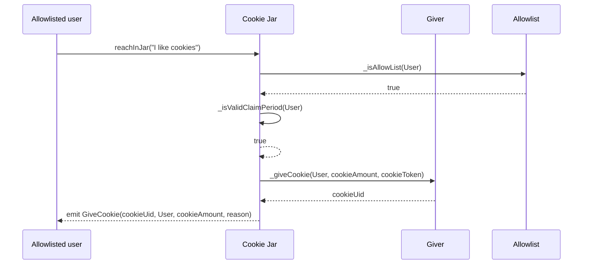

# CookieJar

The cookie jar is a protocol for distributing tokens to users over time. It is designed to be flexible and extensible,
allowing developers to create custom cookie jars with different distribution rules and token types.

The CookieJar protocol supports various types of distributions, including Baal Cookie Jars for distributing tokens to
`Moloch DAO` members, `ERC20` and `ERC721` Cookie Jars for distributing tokens based on users' token balances, `List`
Cookie Jars for
distributing tokens to a pre-approved list of users, `Open` Cookie Jars for distributing tokens to any user who claims
them, and [`Hats`](https://www.hatsprotocol.xyz/) Cookie Jars for distributing tokens based on users' Hat wearingness.

# Architecture

The protocol consists of a set of composable modules to establish multiple types of cookie jars. The core module is
the `CookieJarCore` contract that represents the cookie jar which configures the rate limiting and ownership. By adding
a `Giver` module tokens held by the cookie jar can be distributed from a `6551` smart wallet or a `Safe` contract. Based
on the allowlist, users can claim tokens from the cookie jar.

## Rate limiting

By defining the `amount` and `period` of the cookie jar, the rate of token distribution can be controlled. The `amount`
is the number of tokens distributed per `period`. The `period` is the time interval in seconds between each
distribution.

## Allow lists

Allow lists gate access to the cookie jar. Currently we support `Baal` (MolochV3), `ERC20`, `ERC721`, `List`, `Open`,
and `Hats` gating.

Baal cookie jars are gated by the MolochV3 DAO. The `ERC20` cookie jar is gated by the balance of an ERC20 token.
The `ERC721` cookie jar is gated by the balance of an ERC721 token. The `List` cookie jar is gated by a list of
addresses. The `Open` cookie jar is open to all addresses. The `Hats` cookie jar is gated by the HatID.

## Givers

Givers are the source of tokens for the cookie jar. Currently we support `6551` and `Safe` givers.

The `6551` giver is a smart wallet that holds tokens. The `Safe` giver is a Safe contract that holds tokens.

## Example happy flow



# Deployment

The following table lists the addresses of the deployed contracts:

## Gnosis

<!-- | Contract            | Address                                      |
| ------------------- | -------------------------------------------- |
| Baal Cookie Jar     | `0x7c1Db931F804271E39b04E68221b71Ca94E9AFa5` |
| ERC20 Cookie Jar    | `0x85C60D0674e161B7f9d1d40A2A46e4b788E7F057` |
| ERC721 Cookie Jar   | `0x15f06a6dB8eC8D79Eaa49659210C1c58975a4056` |
| List Cookie Jar     | `0x226E0601aa8b8CC34519c76Be00A7a6a8a4d97d2` |
| Open Cookie Jar     | `0x0C7F0fC0ddb95d7099ED97c10A2DE549c03E39F9` |
| Cookie Jar Factory  | `0xD858ce60102BCEa272a6FA36B2E1770877B8Fa45` |
| List Cookie Jar6551 | `0xb8858dF24B89d9D17954D763b08b860AD24cfd2d` |
| Account             | `0xbCe05b4eB846A033559387e0fa62F3D13EEAAECE` |
| Cookie Jar NFT      | `0xb6F9534F53F3F42a0b25d8ECC290419c98f9f212` | -->

## Goerli

<!-- | Contract            | Address                                      |
| ------------------- | -------------------------------------------- |
| Baal Cookie Jar     | `0x30b3Ac0e403e5102c9f0097E9c65f09E5AaF810c` |
| ERC20 Cookie Jar    | `0x6a2580B166b7132042cCcABa1Fe554fd67440597` |
| ERC721 Cookie Jar   | `0xf3219beFA8d7ae465fbb0DD227F706972943a84E` |
| List Cookie Jar     | `0x92c82e6DFd97e54c5f22bE866b863Ce71f26373f` |
| Open Cookie Jar     | `0x5BeFFF7186811b49d29B5565B161Ea7e3d890CC8` |
| Cookie Jar Factory  | `0x8f60853B55847d91331106acc303F4A8676efc8B` |
| List Cookie Jar6551 | `0x92c82e6DFd97e54c5f22bE866b863Ce71f26373f` |
| Account             | `0x2EC5152cC1706Ba08DaA88FaD23D32f88Bd29988` |
| Cookie Jar NFT      | `0xEA443B2ac5cDfa0357d92941a2F18d3B4C816b81` | -->

## Mainnet

<!-- | Contract            | Address                                      |
| ------------------- | -------------------------------------------- |
| Baal Cookie Jar     | `0x0000000000000000000000000000000000000000` |
| ERC20 Cookie Jar    | `0x0000000000000000000000000000000000000000` |
| ERC721 Cookie Jar   | `0x0000000000000000000000000000000000000000` |
| List Cookie Jar     | `0x0000000000000000000000000000000000000000` |
| Open Cookie Jar     | `0x0000000000000000000000000000000000000000` |
| Cookie Jar Factory  | `0x0000000000000000000000000000000000000000` |
| List Cookie Jar6551 | `0x0000000000000000000000000000000000000000` |
| Account             | `0x0000000000000000000000000000000000000000` |
| Cookie Jar NFT      | `0x0000000000000000000000000000000000000000` | -->

## Optimism

<!-- | Contract            | Address                                      |
| ------------------- | -------------------------------------------- |
| Baal Cookie Jar     | `0x7c1Db931F804271E39b04E68221b71Ca94E9AFa5` |
| ERC20 Cookie Jar    | `0x85C60D0674e161B7f9d1d40A2A46e4b788E7F057` |
| ERC721 Cookie Jar   | `0x15f06a6dB8eC8D79Eaa49659210C1c58975a4056` |
| List Cookie Jar     | `0x226E0601aa8b8CC34519c76Be00A7a6a8a4d97d2` |
| Open Cookie Jar     | `0x0C7F0fC0ddb95d7099ED97c10A2DE549c03E39F9` |
| Cookie Jar Factory  | `0xD858ce60102BCEa272a6FA36B2E1770877B8Fa45` |
| List Cookie Jar6551 | `0x226E0601aa8b8CC34519c76Be00A7a6a8a4d97d2` |
| Account             | `0x2676e97a832F3b7a674732f5F4222b85eDEDD9Df` |
| Cookie Jar NFT      | `0x2c500E43A070F6Fb6c72a41F3D6BcEB4De3FcCA1` | -->

## Sepolia

| Setup              | Address                                                                                                                         |
|--------------------|---------------------------------------------------------------------------------------------------------------------------------|
| Cookie Jar Factory | [`0xA4Bd15948B9cAFfd8DE8a2be59893F2395c9C780`](https://sepolia.etherscan.io/address/0xA4Bd15948B9cAFfd8DE8a2be59893F2395c9C780) |

| Contract          | Address                                                                                                                         |
|-------------------|---------------------------------------------------------------------------------------------------------------------------------|
| Account           | [`0xfd8ee663fA65CAcCf4B488252074B07834D82882`](https://sepolia.etherscan.io/address/0xfd8ee663fA65CAcCf4B488252074B07834D82882) |
| Registry          | [`0x02101dfB77FDE026414827Fdc604ddAF224F0921`](https://sepolia.etherscan.io/address/0x02101dfB77FDE026414827Fdc604ddAF224F0921) |
| NFT               | [`0xF427b9cc56552AaE45ffCe75CE656723a9C22ac6`](https://sepolia.etherscan.io/address/0xF427b9cc56552AaE45ffCe75CE656723a9C22ac6) |
| Baal Cookie Jar   | [`0xc672529A93D8010CAc796c76f9Aae7b2d8250357`](https://sepolia.etherscan.io/address/0xc672529A93D8010CAc796c76f9Aae7b2d8250357) |
| ERC20 Cookie Jar  | [`0x9e4F0a6FE048264ad612B0c9094649dE0AD81a6C`](https://sepolia.etherscan.io/address/0x9e4F0a6FE048264ad612B0c9094649dE0AD81a6C) |
| ERC721 Cookie Jar | [`0x92564a3A1030883F4081487Cb4c61d567E52ebFE`](https://sepolia.etherscan.io/address/0x92564a3A1030883F4081487Cb4c61d567E52ebFE) |
| List Cookie Jar   | [`0x4A72b05E2577114c887Fd7A5606AA5E1147463cB`](https://sepolia.etherscan.io/address/0x4A72b05E2577114c887Fd7A5606AA5E1147463cB) |
| Open Cookie Jar   | [`0xf24DB58d03f26A5daEEFCe825a19136e2582ad49`](https://sepolia.etherscan.io/address/0xf24DB58d03f26A5daEEFCe825a19136e2582ad49) |
| Hats Cookie Jar   | [`0xfC30B3bB071632B031f4Fd3036316F3a37959FF7`](https://sepolia.etherscan.io/address/0xfC30B3bB071632B031f4Fd3036316F3a37959FF7) |

| Safe Module Contracts    | Address                                                                                                                         |
|--------------------------|---------------------------------------------------------------------------------------------------------------------------------|
| Zodiac Baal Cookie Jar   | [`0xF7A3E320bb11e3111Ae0E8b708DCa292c1dE636F`](https://sepolia.etherscan.io/address/0xF7A3E320bb11e3111Ae0E8b708DCa292c1dE636F) |
| Zodiac ERC20 Cookie Jar  | [`0xDa21A3eC5815E68a7D58496f3a06Fb61A139Ce50`](https://sepolia.etherscan.io/address/0xDa21A3eC5815E68a7D58496f3a06Fb61A139Ce50) |
| Zodiac ERC721 Cookie Jar | [`0x1f56e3b81eAED75c08A2f85290D489600aC64b6b`](https://sepolia.etherscan.io/address/0x1f56e3b81eAED75c08A2f85290D489600aC64b6b) |
| Zodiac List Cookie Jar   | [`0xeA1bA9FCEDbaD5C3914B8a9AAadF977B0d056CE1`](https://sepolia.etherscan.io/address/0xeA1bA9FCEDbaD5C3914B8a9AAadF977B0d056CE1) |
| Zodiac Open Cookie Jar   | [`0x5A3257b373d2816108918107D9262C6ac8eA127D`](https://sepolia.etherscan.io/address/0x5A3257b373d2816108918107D9262C6ac8eA127D) |
| Zodiac Hats Cookie Jar   | [`0xe70af4E292701099Ea43aCc67a6A7c9Af04dBFCa`](https://sepolia.etherscan.io/address/0xe70af4E292701099Ea43aCc67a6A7c9Af04dBFCa) |

## 6551 Tokenbound Registry

The Tokenbound Registry for 6551 tokens is deployed on the following chains:

| Chain    | Address                                      |
|----------|----------------------------------------------|
| Arbitrum | `0x02101dfB77FDE026414827Fdc604ddAF224F0921` |
| Gnosis   | `0x02101dfB77FDE026414827Fdc604ddAF224F0921` |
| Optimism | `0x02101dfB77FDE026414827Fdc604ddAF224F0921` |
| Sepolia  | `0x02101dfB77FDE026414827Fdc604ddAF224F0921` |

## Sustainability Safe

To fund further development we implemented sustainability fees when claiming cookies and the option to donate native
tokens or ERC20s when summoning a CookieJar. Donations are optional; summon the CookieJar with `donationToken` =
address(0) and `donationAmount` = 0;

| Chain    | Address                                      |
|----------|----------------------------------------------|
| Gnosis   | `0x1cE42BA793BA1E9Bf36c8b3f0aDDEe6c89D9a9fc` |
| Mainnet  | `0x1cE42BA793BA1E9Bf36c8b3f0aDDEe6c89D9a9fc` |
| Optimism | `0x1cE42BA793BA1E9Bf36c8b3f0aDDEe6c89D9a9fc` |

## Installation

To run the CookieJar contracts, you will need to have foundry installed on your system. You can then run the following
command:

`forge compile`

And you should get no errors

## Testing

To run the tests for the Cookie Jar contracts, you can run the following command:

`forge test`

## Jar features

### Cookie Jar Initialization Parameters

The Cookie Jar contract can be initialized with a set of parameters that define the behavior of the contract. The
parameters are passed to the contract's constructor as an array of values.

The parameters are different depending on the type of Cookie Jar being created. There are three types of Cookie Jars:
Baal, ERC20, and ERC721. The parameters for each type of Cookie Jar are as follows:

#### Baal Cookie Jar

| Parameter | Type    | Description                                                |
|-----------|---------|------------------------------------------------------------|
| 0         | address | The address of the owner or safe target of the Cookie Jar. |
| 1         | uint256 | The length of the period for the Cookie Jar.               |
| 2         | uint256 | The amount of cookies to be distributed per period.        |
| 3         | address | The address of the cookie token contract.                  |
| 4         | address | The address of the DAO contract.                           |
| 5         | uint256 | The threshold for tokens in the DAO.                       |
| 6         | bool    | Whether to use shareTokens.                                |
| 7         | bool    | Whether to use lootTokens.                                 |

#### ERC20 Cookie Jar

| Parameter | Type    | Description                                                |
|-----------|---------|------------------------------------------------------------|
| 0         | address | The address of the owner or safe target of the Cookie Jar. |
| 1         | uint256 | The length of the period for the Cookie Jar.               |
| 2         | uint256 | The amount of cookies to be distributed per period.        |
| 3         | address | The address of the cookie token contract.                  |
| 4         | address | The address of the ERC20 token contract.                   |
| 5         | uint256 | The threshold for balance in the ERC20 token contract.     |

#### ERC721 Cookie Jar

| Parameter | Type    | Description                                                |
|-----------|---------|------------------------------------------------------------|
| 0         | address | The address of the owner or safe target of the Cookie Jar. |
| 1         | uint256 | The length of the period for the Cookie Jar.               |
| 2         | uint256 | The amount of cookies to be distributed per period.        |
| 3         | address | The address of the cookie token contract.                  |
| 4         | address | The address of the ERC721 token contract.                  |
| 5         | uint256 | The threshold for balance in the ERC721 token contract.    |

#### Hats Cookie Jar

| Parameter | Type    | Description                                                |
|-----------|---------|------------------------------------------------------------|
| 0         | address | The address of the owner or safe target of the Cookie Jar. |
| 1         | uint256 | The length of the period for the Cookie Jar.               |
| 2         | uint256 | The amount of cookies to be distributed per period.        |
| 3         | address | The address of the cookie token contract.                  |
| 4         | uint256 | The HatID to check eligibility against                     |

#### Mapping Cookie Jar

| Parameter | Type      | Description                                                |
|-----------|-----------|------------------------------------------------------------|
| 0         | address   | The address of the owner or safe target of the Cookie Jar. |
| 1         | uint256   | The length of the period for the Cookie Jar.               |
| 2         | uint256   | The amount of cookies to be distributed per period.        |
| 3         | address   | The address of the cookie token contract.                  |
| 4         | address[] | The list of addresses allowed to claim cookies.            |

The parameters for each type of Cookie Jar are passed to the summonCookieJar function as a byte array. The byte array is
constructed by encoding the parameters in the order listed above.

### Generating IDs

The CookieUtils library provides utility functions for generating unique identifiers (UIDs) for cookies and cookie jars.

#### getCookieJarUid

The getCookieJarUid function is used to generate a unique identifier for a cookie jar. The function takes an address
parameter cookieJarAddr and returns a string that represents the unique identifier.

For example, to generate a unique identifier for a new cookie jar, you can call the getCookieJarUid function with the
address of the new cookie jar as the input parameter:

```js
    function getCookieJarUid(address

cookieJarAddr
)
internal
view
returns(string
memory
)
{
    return string(abi.encodePacked(Strings.toHexString(uint160(cookieJarAddr)), Strings.toHexString(block.chainid)));
}
```

The unique identifier is generated by concatenating the hexadecimal representation of the cookieJarAddr parameter with
the hexadecimal representation of the current blockchain chain ID.

#### getCookieUid

The getCookieUid function is used to generate a unique identifier for a cookie. The function takes a string parameter
cookieJarUid and returns a string that represents the unique identifier.

Similarly, to generate a unique identifier for a new cookie, you can call the getCookieUid function with the unique
identifier of the cookie jar as the input parameter:

```js
   function getCookieUid(string

memory
cookieJarUid
)
internal
view
returns(string
memory
)
{
    return bytes32ToString(keccak256(abi.encodePacked(cookieJarUid, msg.sender, block.timestamp)));
}
```

The unique identifier is generated by concatenating the cookieJarUid parameter with the hexadecimal representation of
the current user's address and the current block timestamp.

### Details schema

```json
{
  "type": "Baal",
  "name": "Moloch Pastries",
  "description": "This is where you add some more content",
  "link": "app.daohaus.club/0x64/0x0....666"
}
```

### Post Claim Reason

The post claim reason event is used to store a reason for a claim made by a user. The event has the following schema:

```json
{
  "tag": "CookieJar.<jar_uid>.reason.<cookie_uid>",
  "reason": "...reason...",
  "link": "app.daohaus.club/0x64/0x0....666"
}
```

- tag: A string that identifies the type of event and the unique identifier of the CookieJar contract and the cookie.
- content: A string that contains the reason for the claim.

### Assess Reason

The assess reason event is used to store an assessment of a reason for a claim made by a user. The event has the
following schema:

```json
{
  "tag": "CookieJar.<jar_uid>.reaction.<cookie_uid>",
  "content": "...reason...",
  "link": "app.daohaus.club/0x64/0x0....666"
}
```

- tag: A string that identifies the type of event and the unique identifier of the CookieJar contract and the cookie.
- content: A string that contains the assessment of the reason for the claim.
